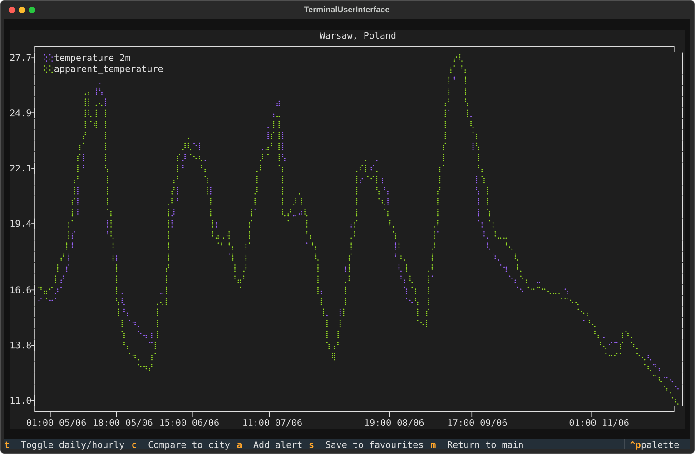
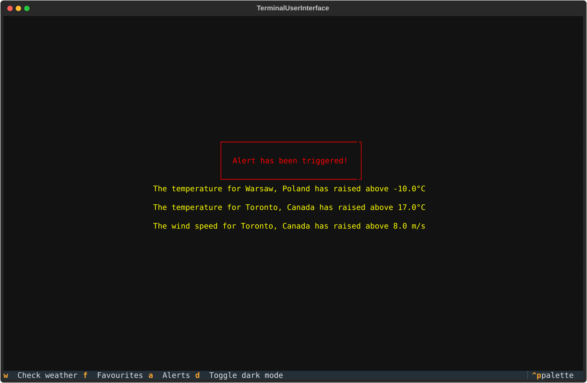
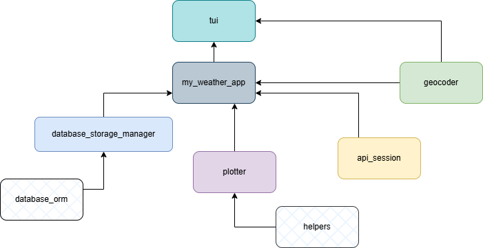
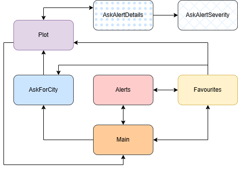

## What is this?
Terminal app for viewing weather forecast plots for (almost) any place on Earth.




## How to run?
1. Install dependencies (you may use venv)

``` pip install -r requirements.txt```

2. Run the app

```python3 terminal_user_interface.py```

## How is implemented?


- `api_session.py` contains `ApiSession` class that implements the methods used to get data: `get_current_weather(lat, lon)`,`get_hourly_data(lat, lon)` and `get_daily_data(lat, lon)`. If latitude and longitude are not provided, a random default city is picked. These methods return objects of `CurrentWeatherForecast`, `HourlyWeatherForecast` and `DailyWeatherForecast` respectively, that represent the response returned by the [`OpenMeteo API`](https://open-meteo.com/en/docs).

- `database_orm.py` uses [`peewee`](https://docs.peewee-orm.com/en/latest/index.html) to define a database model with 2 tables: `Alert` and `Favourite`.

- `geocoder.py` – module that contains 2 self explanatory functions: `city_name_to_coords()` and `coords_to_city_name()` Uses [`geopy`](https://geopy.readthedocs.io/en/stable/)'s [Nominatim](https://geopy.readthedocs.io/en/stable/#nominatim) to geocode coordinates and reverse the process. So called adapter between user who is writing city names and `ApiSession`, which operates exclusively on coordinates.

- `my_weather_app.py` is the main API, that provides unified interface to ApiSession(), Geocoder() and Plotter().

- `plotter.py` uses [`plotext`](https://github.com/piccolomo/plotext) to draw plots in the terminal.

- `terminal_user_interface.py` is a [`textual`](https://github.com/Textualize/textual) app that brings everything together.
Below is a diagram of screens.



